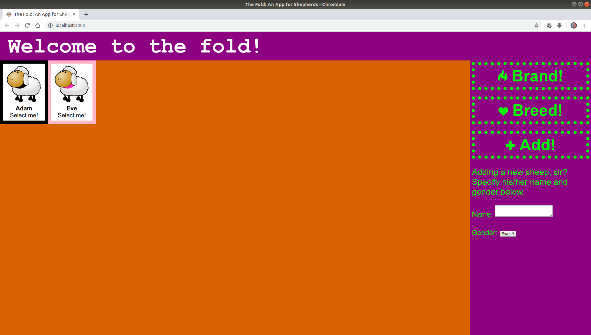

# TheFold: An App for Shepherds

My submission for [Wren's technical test](https://github.com/WrenKitchensLtd/wren-js-task).

## Installation and Running

* Download this repository.
* Within the copy of this repository on your machine, run `npm install` and then `npm start`.
* Hopefully you'll then be directed to webpage suspiciously like the one in the image below.

## Using the App

* Press "Brand!" to brand a random sheep, rendering it unable to breed.
* Press "Breed!" to breed a random ram and ewe, producing a new lamb.
* Press "Add!", with the option of specifying the name and gender, to add a new sheep to the flock.

## Known Issues

At the time of writing this app has the following known issues:

* The file structure does not conform exactly to those specified in the link above.
* Running `npm install`, while successful, currently produces a number of warnings and vulnerabilites, 5 of which are serious.
